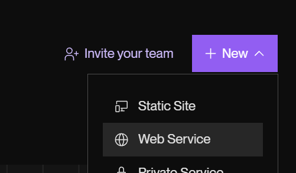
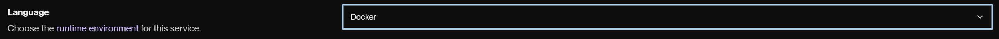
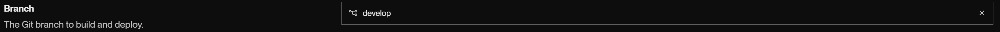
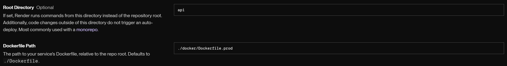
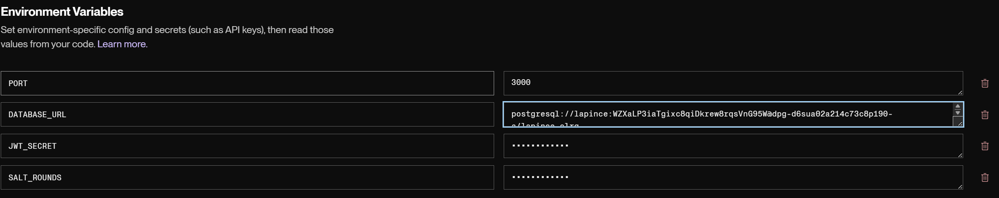

---
# Sommaire
---

### 1) Lancement des sevices
- [Lancement des services (dev)](#lancement-des-services-dev)
- [Lancement des services (prod)](#lancement-des-services-en-production-docker)
- [Lancement des services (dev docker)](#lancement-des-services-en-dev-docker)

### 2) Instructions code
- [Instructions code](#2-instructions-code)

### 2) Déploiement
- [Déploiement Render.com](#render)

### 3) Documentation
- [Documentation API](#documentation-api)


---
# 1) Lancement des services 
---

## Lancement des services (dev)

Cette partie montre comment lancer séparement chaque service à la main sans Docker.

### Client

Pour lancer le front pendant le développement :

- Copier le fichier `client/.env.example` vers un nouveau fichier `client/.env`.
  - Vérifier que l'adresse du serveur API `VITE_API_BASE_URL` corresponde bien au niveau du port avec celui utilisé par l'API dans le fichier `api/.env` avec la variable `PORT`.

- Lancer le serveur front avec : 
```
cd client # si on est à la racine du dépot
npm install
npm run dev
```

- Penser à bien lancer le service API et la base de données.


### API

Pour lancer le serveur API durant le développement :

- Copier le fichier `api/.env.example` vers `api/.env` (bien faire attention à la variable PORT 
  qui doit correspondre au port contenu dans VITE_API_BASE_URL du client).

- Lancer le serveur API avec les commandes suivantes :
```
cd api # si on est à la racine du dépot
npm install
npm run dev
```

- Penser à bien lancer la base de données.


### Base de donnée

Pour lancer la base de données il faut une base de donnée dans PostgreSQL.

- Se connecter au client psql avec l'utilsateur `posgres` : 
```
psql -U postgres
```
- Puis saisir ces commandes dans le client psql :
```
CREATE USER lapince PASSWORD 'lapince';
CREATE DATABASE lapince OWNER lapince;
ALTER ROLE lapince CREATEDB;
```

La dernière commande est utile pour prisma qui a besoin des droits pour créer une base de donnée test. Sans cela une erreur `Error: P3014` peut appraitre avec la commande `npx prisma migrate dev`.

- Ensuite pour créer les tables dans la base de données :
```
cd api
npm run db:migrate:dev
```

## Lancement des services en production (Docker)

Pour lancer tous les services en même temps (database, api, client) en mode production, il faut se placer à la racine du projet et saisir la commande :
```
npm run docker:prod
```

Pour arrêter tous les services : 

```
npm run docker:prod:down
```

## Lancement des services en dev (Docker)

Pour lancer tous les services en même temps (database, api, client) en mode production, il faut se placer à la racine du projet et saisir la commande :
```
npm run docker:dev
```

Pour arrêter tous les services : 

```
npm run docker:dev:down
```

---
# 2) Instructions code
---

Pour chaque création de nouvelle fonctionnalité le code doit être écrit dans une nouvelle branche
au format suivant : `feature/nom-de-la-fonctionnalité`. 

- Avant de créer une nouvelle branche il faut s'assurer d'être dans la branche master :
```
git switch master
```

- Ensuiter créer une nouvelle branche :
```
git checkout -b feature/nom-de-la-fonctionnalité
```

- Penser à créer des commits réguliers au format: `feat: création d'un composant pour l'accueil` : 
```
git add .
git commit -m "feat: création d'un composant pour l'accueil"
```

- Une fois la fonctionnalité est terminée et fonctionnelle, pousser le code sur le repot distant :
```
git push -u origin feature/nom-de-la-fonctionnalité
```

- Faire une pull request sur le dépot [github](https://github.com/O-clock-Francfort/la-pince) :

  - Cliquer sur "Compare & pull request"
  
  
  
  - Cliquer sur "Create Pull Request"
  
  


---
# 3) Déploiement
---

## Render

Pour déployer le site sur Render, on doit lui donner l'adresse d'un dépot publique. Le dépot de la pince est privé. Il faut créer un clone du dépot sur notre propre compte Github et le mettre en publique.

### Cloner de dépot

- Créer un mirroir du dépot sur l'ordinateur localement :
```
git clone --mirror git@github.com:O-clock-Francfort/la-pince.git
```

- Créer un nouveau dépot sur notre propre compte Github.

- Envoyer la copie créer sur l'ordinateur en local vers le nouveau dépot Github :
```
git push --mirror git@github.com:TON-USERNAME/nom-du-repo.git
```
### Sur Render

Il faut créer 3 services (database, api, client).

#### Database

Il faut créer un service Postgres sur Render. Noter l'url pour les variabels d'environnement du service API.

#### API

- Créer un nouveau service :




- Choisir le runtime Docker :



- Choisir la branche à déployer :



- Choisir le dossier racine correspondant au dossier `api` :



- Indiquer la valeur des variables d'environnement. Attention il faut mettre l'url du service de la base de donnée sur render :



#### Client 

Même chose que pour l'API en indiquant les chemins vers le répertoire `client` et le fichier Dockerfile.prod du dossier `client/docker`. Il faut également donne en variable d'environnement l'url du service API. 

Attention render met toujours le port 80 pour tous les services, même si on lui demande un autre port sur le service API.


---
# 4) Documentation API
---
La documentation est accessible via l'API sur : http://localhost:3000/docs. 

Elle aussi disponible au format json ici : `./api/docs/api-doc.json`.
