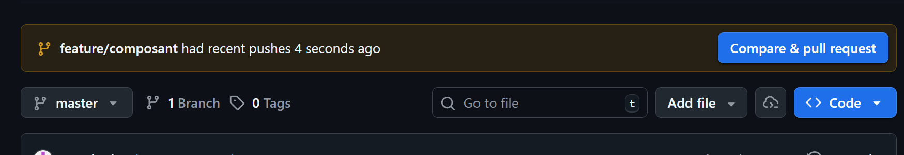
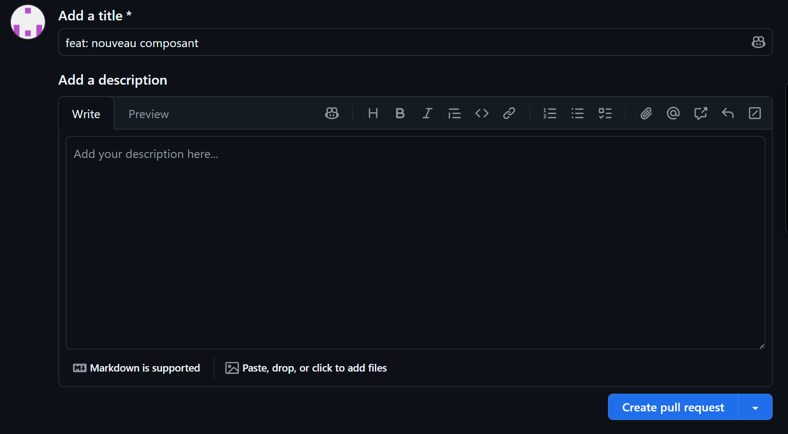

# Installation et développement

Cette partie répertorie l'ensemble des actions à effectuer pour lancer les environnements de 
développement, de test.


## Client

Commande pour lancer l'interface front durant le développement :
```
cd client # si on est à la racine du dépot
npm install
npm run dev
```


## API

Pour lancer le serveur API durant le développement :

- Copier le fichier `api/.env.example` vers `api/.env`.
- Saisir les commandes suivantes :
```
cd api # si on est à la racine du dépot
npm install
npm run dev
```

## Base de donnée

Il faut créer une base de donnée dans PostgreSQL.

- Se connecter au client psql avec l'utilsateur `posgres` : 
```
psql -U postgres
```
- Puis saisir ces commandes dans le client psql :
```
CREATE USER lapince PASSWORD 'lapince';
CREATE DATABASE lapince OWNER lapince;
ALTER ROLE lapince CREATEDB;
```

La dernière commande est utile pour prisma qui a besoin des droits pour créer une base de donnée test. Sans cela une erreur `Error: P3014` peut appraitre avec la commande `npx prisma migrate dev`.


# Instructions code


Pour chaque création de nouvelle fonctionnalité le code doit être écrit dans une nouvelle branche
au format suivant : `feature/nom-de-la-fonctionnalité`. 

- Avant de créer une nouvelle branche il faut s'assurer d'être dans la branche master :
```
git switch master
```

- Ensuiter créer une nouvelle branche :
```
git checkout -b feature/nom-de-la-fonctionnalité
```

- Penser à créer des commits réguliers au format: `feat: création d'un composant pour l'accueil` : 
```
git add .
git commit -m "feat: création d'un composant pour l'accueil"
```

- Une fois la fonctionnalité est terminée et fonctionnelle, pousser le code sur le repot distant :
```
git push -u origin feature/nom-de-la-fonctionnalité
```

- Faire une pull request sur le dépot [github](https://github.com/O-clock-Francfort/la-pince) :

  - Cliquer sur "Compare & pull request"
  
  
  
  - Cliquer sur "Create Pull Request"
  
  


# Déploiement

Pour l'instant seul le service client peut être déployé.

```
# il faut se placer à la racine
cd client

# pour pouvoir lancer la transpilation ensuite
npm install 

# pour créer le dossier dist qui contient les fichiers transpilés du front
npm run build 

# retour à la racine
cd .. 

# lancement du service client
docker compose -f .\deploy\docker-compose.yml up
```